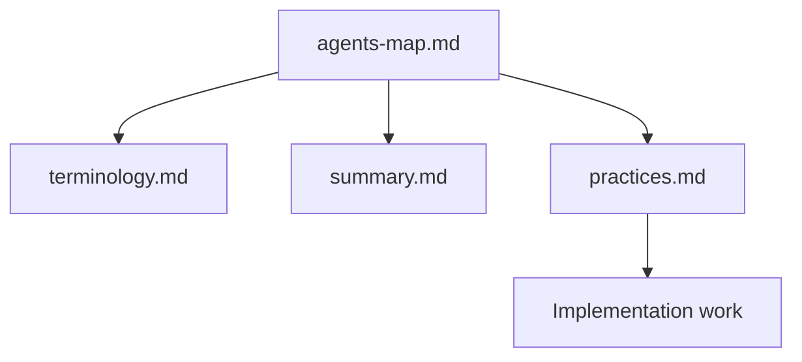

# Agents Map

Start here for AI-facing project memory.

## Top-level docs

- `summary.md` - current product and architecture snapshot.
- `terminology.md` - domain language used in the tracker.
- `practices.md` - coding and persistence rules for this repo.

## Read order

## Related docs

- `summary.md`
- `terminology.md`
- `practices.md`
- `../architecture.md`
