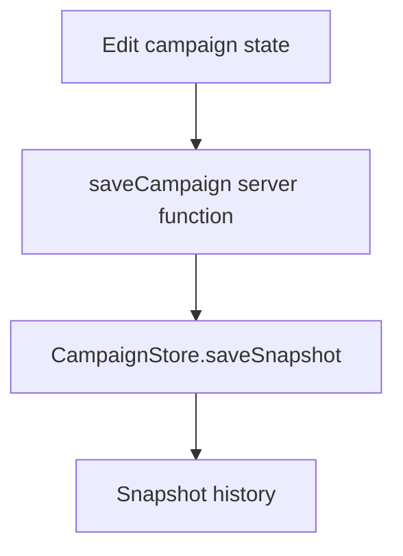

# Practices

## Persistence

- Save campaign state through `CampaignStore.saveSnapshot`; do not write ad hoc keys into Durable Object storage.
- Keep only asset references in `CampaignState.map`; asset bytes belong in R2.
- When returning Durable Object data through server functions, sanitize it into plain serializable objects first.

## UI

- Keep shared domain types in `src/lib/campaign.ts`.
- Keep server-only code in `src/server/`.
- Keep the root-path redirect logic in `src/server.ts`; it owns the cookie-based last-campaign redirect.
- Generate marker icons locally with `scripts/generate-marker-library.mjs`; do not depend on deployed Worker secrets for marker art.
- Use `pnpm` for install, build, deploy, and generation commands.
- Store uploaded companion and location images in R2 and resolve them back into `CampaignAssets.entityAssetDataUrls` for rendering.
- Prefer direct event handlers over `useEffect`; the map editor uses pointer handlers instead of effect-based listeners.

## Infra

- `wrangler.jsonc` defines local bindings and migrations.
- `alchemy.run.ts` is the deployment-oriented infra entrypoint.
- `src/server.ts` is the Cloudflare custom server entrypoint and must re-export `CampaignStore`.

## Example

## Related docs

- `summary.md`
- `terminology.md`
- `../architecture.md`
