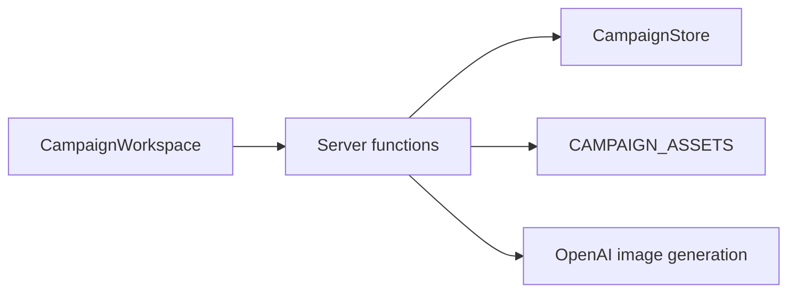

# Project Summary

Five Leagues CharSheet is a single-user campaign tracker for Five Leagues from the Borderlands. Each campaign lives at a code-based URL like `/<campaign-code>`, the latest code is remembered in a cookie for SSR redirect, and the app uses tabs for roster, campaign, and map work. The roster starts empty and supports up to eight adventurer cards with portrait uploads, campaign tracking uses custom threat names plus numeric values, and the region map supports draggable locations, location image uploads, a horse marker for current party position, drawable subregions, and a hidden-location workflow where discovered places live in a sidebar until dragged onto the map. The app runs on TanStack Start inside Cloudflare Workers, keeps campaign state in a SQLite-backed Durable Object, stores uploaded images in R2, serves locally generated marker icons from `public/marker-library`, uses `pnpm`, and provisions infra through `alchemy.run.ts`.

## System shape



## Code example

```ts
const snapshot = await stub.saveSnapshot({
  state: nextState,
  reason: "Manual save",
});
```

## Invariants

- `CampaignStore` is the only persisted source of truth for campaign data.
- R2 holds the actual bytes for map uploads and marker art.
- The UI works against normalized coordinates and asset data URLs resolved server-side.

## Related docs

- `agents-map.md`
- `terminology.md`
- `practices.md`
- `../architecture.md`
