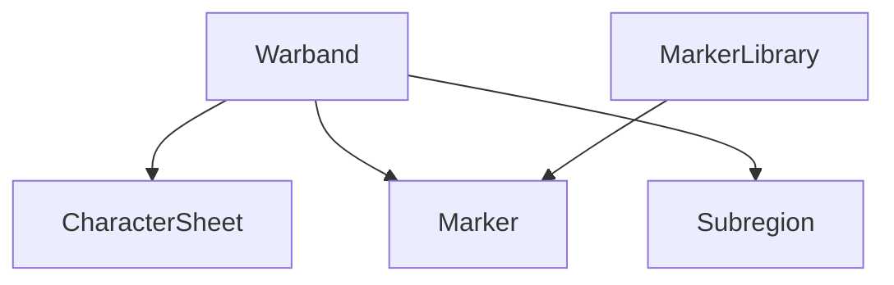

# Terminology

- warband - the campaign's party-level data such as name, region, stash, backpack, and shared notes.
- character sheet - one of the eight roster slots mirrored from the PDF roster sheet.
- marker library - reusable generated icon art keyed by location type or town variant.
- marker - a placed location on the map with coordinates, title, and notes.
- hidden site - a discovered place whose exact map position is not pinned yet; it stays in the sidebar list until dragged onto the map.
- adventurer card - a user-added roster entry for one companion, optionally with a portrait image.
- subregion - a polygon drawn over the uploaded region map with title, notes, and color.
- party position - a dedicated horse marker showing where the warband currently is on the region map.

## Vocabulary map



## Code example

```ts
type MapMarker = {
  kind: "town" | "delve" | "enemy-camp"
  x: number
  y: number
  notes: string
}
```

## Related docs

- `summary.md`
- `practices.md`
