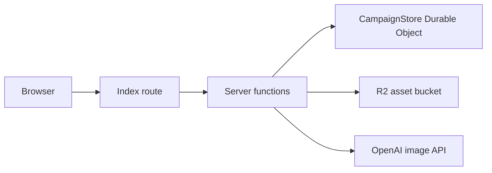

# Architecture

## Stack

- Framework: TanStack Start with file-based TanStack Router routes
- Runtime: Cloudflare Workers with a custom `src/server.ts` entrypoint
- State: Cloudflare Durable Objects with SQLite-backed storage
- Assets: Cloudflare R2 for region maps and generated map marker art
- Infra: Alchemy in `alchemy.run.ts`
- Styling: Tailwind CSS v4 plus custom CSS variables in `src/styles.css`

## System shape



## Example

```ts
export const loadCampaign = createServerFn({ method: "GET" }).handler(async () => {
  const stub = env.CAMPAIGN_STORE.get(env.CAMPAIGN_STORE.idFromName("default-campaign"));
  const snapshot = await stub.getSnapshot();
  return snapshot;
});
```

## Invariants

- Keep binary assets out of Durable Object storage; only persist asset references there.
- Normalize marker and subregion coordinates to `0..1` so map data stays resolution-independent.
- Export Durable Objects from `src/server.ts` so Wrangler and Cloudflare can bind them.
- Keep server-only imports out of client modules; shared types live in `src/lib/`.
